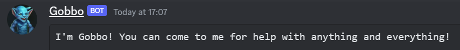
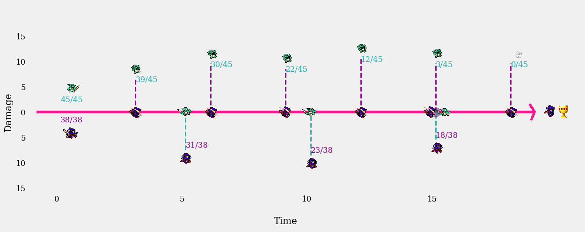
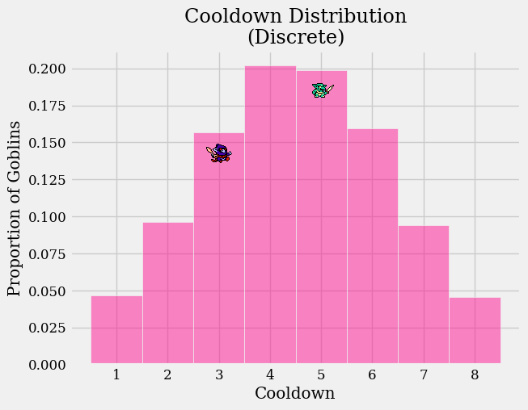
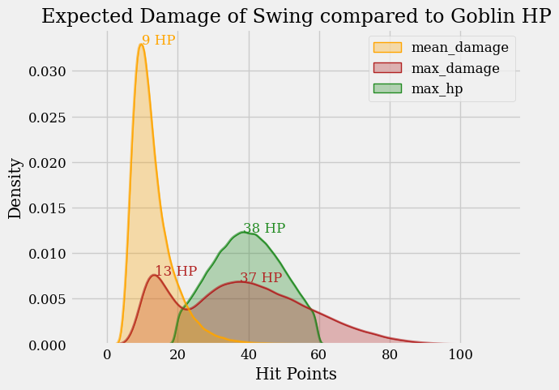
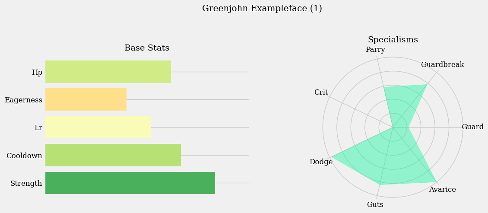

# Mini Project: Glicko Goblins :zombie:

## Overview
This has grown to be more than a mini project... glicko_goblins is now a discord bot hosted locally on a private discord server via a RaspberryPi. There is an economy in which members can trade fake currency. The value of the currency depends on real-time non-financial data such as individuals' video game results or global weather and climate phenomena. Currency can be traded for a centralized currency - Gold - which can be used to sponsor goblins in the Goblin Tournaments that this repo started out as. Sponsored goblins return money to their sponsor based on success. 

To give currency further nuance and purpose, users can purchase image files, collect pets (WIP), purchase virtual property (WIP) or gamble away their earnings if they so wish. User transactions often incurr some form of tax which overflows into a tax pool. The value of the tax pool contributes to the maximum earnings value of each user at any given time, and a proportion of its value is regularly distributed back to users to further encourage interaction.

Gobbo is your UI for interacting with the economy. 



He gives users the ability to:
- Buy and Sell
- Sponsor
- Invest
- Steal
- Give
- Gamble

----

## The Glicko System
Having recently been down the rabbit hole of rating systems, here I implement the Glicko rating system in the context of a probability-based combat simulation game between goblins in a thunderdome.

I recommend the following two papers as both sources of my implementation and very interesting reads:
- [A Comprehensive Guide to Chess Ratings, Glickman](http://www.glicko.net/research/acjpaper.pdf)
- [The Glicko System, Glickman](http://www.glicko.net/glicko/glicko.pdf)

TLDR; the Glicko system aims to fix a shortcoming of the Elo system, being the reliability of a player's rating. It introduces a Standard Deviation metric to a player's rating and also a time-axis such that the reliability of a player's rating decays with time away from play. 

That being said, unlike Elo it cannot be used to effectively order players by skill, as it describes a range that a player's hidden "skill" parameter is likely to be in to a certain degree of confidence.

In the context of Glicko Goblins, tournaments have a number of contestants, a number of days they run for and a number of combats per day. Contestants are selected each day based on their distributions of eagerness. Selected players are sorted by rating and roughly matched against similarly rated opponents. 

Contestants can participate in multiple combats per day or not participate at all. If a participant does not participate, they get progressively 'rustier' the more days that pass. 

- The Rating System itself is found in [glicko.py](glicko_goblins/glicko.py)
    - The time period after which the players' ratings are updated is 1 tournament day. 

## Goblins
Goblin combat is a simple probability based 1v1. Two goblins swing at one another until the Hit Points (HP) of one goblin are reduced to zero. See *Figure 1* in which a single combat has been represented as a timeline. Here the Purple Goblin successfully defeats the Green Goblin.



*Figure 1: Combat Timeline*

----
The combat behaviours of a goblin are determined by their stats. A goblin's stats are generated from a set of random variables, some dependent on others.

 The Green Goblin in *Figure 1* swings every 5 iterations whilst the Purple Goblin swings every 3. This property is described by the **Cooldown** stat, and the value of a goblin's cooldown is sampled randomly from the distribution in *Figure 2*.



*Figure 2: Cooldown Distribution*

----
When a goblin swings, many factors go into determining the damage dealt, however some general damage expectations are observable in *Figure 3*. The distributions in *Figure 3* are the result of 280,000 goblins participating in 5,766,176 combats.



*Figure 3: Damage Expectations*

----
From this data we can glean that the most typical goblin hitting another typical goblin can reasonably expect to defeat their opponent in 5 hits. This aligns with *Figure 1* in which a goblin with above average HP took 6 hits to defeat.

A typical strongest hit - perhaps a **Critical Hit** for example - is probably not quite enough to defeat the average goblin in a single hit. That being said, particularly powerful goblins are capable of defeating particularly weak goblins in a single hit, and depending on the extent of their power can potentially defeat any goblin in a single hit.

Just how 'powerful' a goblin is can be loosely determined by looking at all of their stats as a collective. *Figure 4* shows a summary plot for a single goblin.


*Figure 4: Goblin Stats (Note: Stats are normalized for comparability and Cooldown and Guts are inverted such that a low value results in a larger plot value)*

As described above, **HP** and **Cooldown** are conceptually simple. Similarly, **Eagerness** merely quantifies how likely a goblin is to participate in combat. A goblin with an *Eagerness* of 5 is 5x more likely to participate in any given combat than a goblin with an **Eagerness** of 1.

Beyond these three initial stats, exactly what a particular stat describes becomes more opaque as the complexity of the functions they are used in increases.

Continuing to observe Base Stats, **Learning Rate** (LR) is a single factor in determining how much a goblin's power increases from one combat to the next. This is one of two non-static properties that change between combats, the other being **Guts**.

Recalling that goblin combats occurr in a tournament-like structure where goblins are rated, **Learning Rate** is used in conjunction with the Glicko Rating and Rating Deviation of each goblin to determine how much more powerful each goblin should become given the outcome of a combat. 

----


## Usage:

- Visit the [discord developer portal](https://discord.com/developers/docs/intro) and follow instructions to add a bot to your server.

- Create a .env file in this directory to enable real time currencies. It should contain the following content:
```
DISCORD = "YOUR_API_KEY"
RIOT = "YOUR_API_KEY"
SUMMONERS = [["GBP", "MadeUpPersonAccountName", "tft"], ["USD", "SecondImaginaryDude", "lol"]]
```

- Run [setup.py](setup.py)

- Run [main.py](main.py)